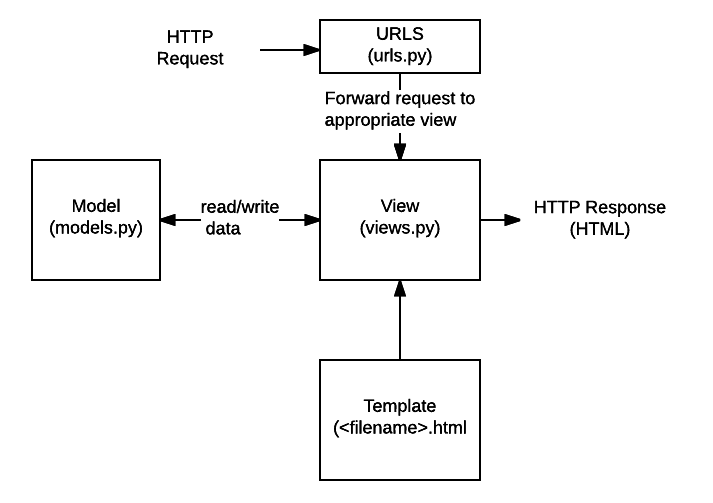

# Django CRUD




### 1. 가상환경 구축 / 프로젝트 생성 / 앱 등록

1. 가상환경할 폴더에서 시작 (`venv`라는 가상환경을 `venv`라는 이름으로 사용하겠다)

   `$ python -m venv venv`

2. 그 다음 활성화시키기 위해 (가상환경 끄려면 `deactivate`)

   `$ source venv/Scripts/activate`

3. 확인하기 위해 

   `$ pip list`

4. django 설치

   `$ pip install django`

5. 프로젝트 생성 (프로젝트 이름 : crud)

   `$ django-admin startproject 프로젝트이름 .`

6. 앱 생성 (앱 이름 : articles)

   `$ python manage.py startapp 앱이름`

7. 앱 등록하기

   `settings.py`에서 INSTALLED_APPS 안에 앱 이름 등록

   

   > ```python
   > # settings.py 설정하기
   > 
   > # TEMPLATES 안 'DIRS' 설정
   > 'DIRS': [os.path.join(BASE_DIR, 'crud', 'templates')],
   > 
   > # 언어, 시간 설정
   > LANGUAGE_CODE = 'ko-kr'
   > 
   > TIME_ZONE = 'Asia/Seoul'
   > ```


### 2. Modeling

1. models.py에 테이블 정의

   ```python
   from django.db import models
   
   class Article(models.Model):
       title = models.CharField(max_length=20)
       content = models.TextField()
       created_at = models.DateTimeField(auto_now_add=True)
       updated_at = models.DateTimeField(auto_now=True)
   
       def __str__(self):
           return f'제목: {self.title}, 내용: {self.content}'
   ```

   

2. make migrations을 통해 설계도 만들기 ==> (앱 등록!! 해야 가능)

   `$ python manage.py makemigrations`

   

   migrate commit 메세지 확인

   `$ python manage.py sqlmigrate 앱이름 0001`

   migrate 상태 보기

   `$ python manage.py showmigrations`


3. migrate를 통해 데이터베이스에 반영

   `$ python manage.py migrate`


### 3. 기본 틀 만들기 |`base.html`, `templates`, `urls.py`/앱 아래 

1. `base.html` 구성하기 (Bootstrap 탭 가져오기)

   ```html
   <!DOCTYPE html>
   <html lang="en">
   <head>
       <meta charset="UTF-8">
       <meta name="viewport" content="width=device-width, initial-scale=1.0">
       <meta http-equiv="X-UA-Compatible" content="ie=edge">
       <link rel="stylesheet" href="https://stackpath.bootstrapcdn.com/bootstrap/4.3.1/css/bootstrap.min.css" integrity="sha384-ggOyR0iXCbMQv3Xipma34MD+dH/1fQ784/j6cY/iJTQUOhcWr7x9JvoRxT2MZw1T" crossorigin="anonymous">
       <title>Document</title>
   </head>
   <body>
       <h1 class="text-center">CRUD</h1>
       <div class="container">
           
           
       </div>
       <script src="https://code.jquery.com/jquery-3.3.1.slim.min.js" integrity="sha384-q8i/X+965DzO0rT7abK41JStQIAqVgRVzpbzo5smXKp4YfRvH+8abtTE1Pi6jizo" crossorigin="anonymous"></script>
       <script src="https://cdnjs.cloudflare.com/ajax/libs/popper.js/1.14.7/umd/popper.min.js" integrity="sha384-UO2eT0CpHqdSJQ6hJty5KVphtPhzWj9WO1clHTMGa3JDZwrnQq4sF86dIHNDz0W1" crossorigin="anonymous"></script>
       <script src="https://stackpath.bootstrapcdn.com/bootstrap/4.3.1/js/bootstrap.min.js" integrity="sha384-JjSmVgyd0p3pXB1rRibZUAYoIIy6OrQ6VrjIEaFf/nJGzIxFDsf4x0xIM+B07jRM" crossorigin="anonymous"></script>
   </body>
   </html>
   ```

   ==> 이렇게 만든 `base.html`을 다른 html 파일에서 확장해서 사용 가능

   ```html
   <!-- 다른 .html -->
   
   
   
   
   ```


2. 앱 아래에 `templates` 폴더 만들기

   ```text
   articles
   	templates
   		articles
   ```

   ==> name space 구분을 위해 (directory별 인위적으로 구분!)

   ​	   같은 이름의 html 파일이 있더라도 어느 앱에 해당하는건지 구분해주기 위함


3. `urls.py` 분리하기

   : 앱 아래 `urls.py` 파일 만들기

   ==> 한 곳에 몰빵할시 순서에 따라 접근되는 문제가! (전반기 수업 때 utilities 앱 하나 더 만들었을 때 참고)

   ​		INSTALLED_APPS에 등록된 순서대로 접근함

   - `urls.py(/프로젝트)` : 오리지널. 문지기 역할(어떤 앱으로 뿌려줄건지)
   
   - `urls.py(/앱)`


---


### 1. Index 구현


### 2. Create


### 3. Read


### 4. Delete


### 5. Update


```python
# views.py

from django.shortcuts import render, redirect
from .models import Article
from IPython import embed

def index(request):
    print(request.method)
    articles = Article.objects.order_by('-pk')
    context = {'articles': articles}
    return render(request, 'articles/index.html', context)

def new(request):
    return render(request, 'articles/new.html')

def create(request):
    try:
        title = request.POST.get('title')
        content = request.POST.get('content')
        article = Article(title=title, content=content)
        article.full_clean()
    except ValidationError:
        raise ValidationError('Your Error Message')
    else:
        article.save()
    # embed()
    return redirect('articles:index')

def detail(request, pk):
    article = Article.objects.get(pk=pk)
    context = {'article': article}
    return render(request, 'articles/detail.html', context)

def delete(request, pk):
    article = Article.objects.get(pk=pk)
    article.delete()
    return redirect('articles:index')

def edit(request, pk):
    article = Article.objects.get(pk=pk)
    context = {'article': article}
    return render(request, 'articles/edit.html', context)

def update(request, pk):
    article = Article.objects.get(pk=pk)
    article.title = request.POST.get('title')
    article.content = request.POST.get('content')
    article.save()
    return redirect('articles:detail', article.pk)

```


```python
# urls.py / 앱 아래

from django.urls import path
from . import views

app_name = 'articles'

urlpatterns = [
    path('', views.index, name='index'),
    path('new/', views.new, name='new'),
    path('create/', views.create, name='create'),
    path('<int:pk>/', views.detail, name='detail'),
    path('<int:pk>/delete/', views.delete, name='delete'),
    path('<int:pk>/edit/', views.edit, name='edit'),
    path('<int:pk>/update/', views.update, name='update'),
]
```


#### + `urls.py/앱` 에서 앱 이름 설정하고 경로 간편화

: 경로에 대한 의존성 문제 해결하기 위해서 ( 경로 수정이 필요할 때 `urls.py`에서만 수정 가능하도록! )

```python
# urls.py / 앱

from django.urls import path
from . import views

app_name = 'articles'

urlpatterns = [
    path('', views.index, name='index'),
    path('new/', views.new, name='new'),
    path('create/', views.create, name='create'),
    path('<int:pk>/', views.detail, name='detail'),
    path('<int:pk>/delete/', views.delete, name='delete'),
    path('<int:pk>/edit/', views.edit, name='edit'),
    path('<int:pk>/update/', views.update, name='update'),
]

# .py 에서
return redirect('articles:detail', article.pk)

# .html 에서
<form action="" method=POST>
```


### + GET 과 POST 형식 두 개 합치기

##### - new(GET) + create(POST)

##### - edit(GET) + update(POST)


embed() 사용해서 

`$ pip install django-extensions`

`$ pip install ipython`

함수 안 수행되는 부분을 if문 사용하여 구분해주기

```python
def create(request):
    # POST 요청일 때
    if request.method == 'POST':
        title = request.POST.get('title')
        content = request.POST.get('content')
        article = Article(title=title, content=content)
        article.save()
        return redirect(f'/articles/{article.pk}/')
    # GET 요청일 때
    else:
        return render(request, 'articles/create.html')
    
def update(request, pk):
    # embed()
    article = Article.objects.get(pk=pk)
    # POST 요청일 때
    if request.method == 'POST':
        article.title = request.POST.get('title')
        article.content = request.POST.get('content')
        article.save()
        return redirect(f'/articles/{article.pk}/')
    # GET 요청일 때
    else:
        context = {'article': article}
        return render(request, 'articles/edit.html', context)
```


### + delete | GET >> POST로 바꿔주기